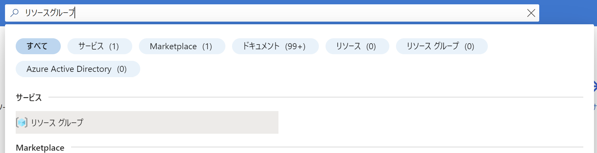
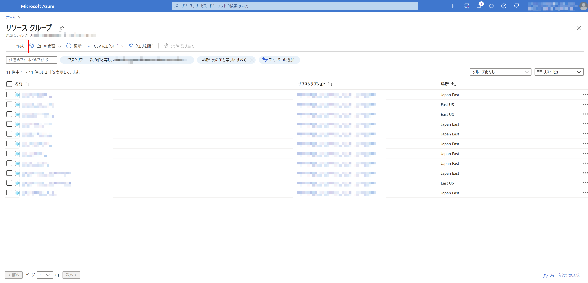
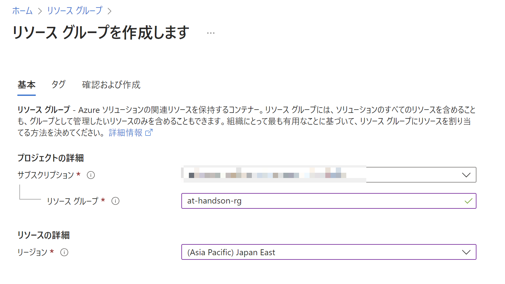

# Exercise1: リソースグループ作成

## 【目次】

1. [リソースグループ作成](#リソースグループ作成)

## リソースグループ作成

1. Azure ポータル上部にある検索窓で「リソース」を検索して、「リソースグループ」を選択

    

1. 「リソースグループ」の一覧上部にある「作成」を選択

    

1. 「リソースグループを作成」の「基本」ページにて以下を設定、「確認のよび作成」

      * サブスクリプション： （今回利用予定のサブスクリプション）
      * リソースグループ：（任意名称）
      * リージョン： `Japan East`

    

1. 「確認および作成」画面では内容を確認して「作成」

1. 作成完了後、一覧に作成したリソースグループが出てきていることを確認
