# Exercise2: Azure OpenAI Service 作成

## 【目次】


1. [AOAIリソース作成](#aoaiリソース作成)
1. [デプロイモデル作成](#デプロイモデル作成)
1. [プレイグラウンドでテスト](#プレイグラウンドでテスト)

## AOAIリソース作成

※複数人でハンズオン実施する場合、代表者のみ実施してください。

1. Azure ポータル上部にある検索窓で「OpenAI」を検索して、「Azure OpenAI」を選択

    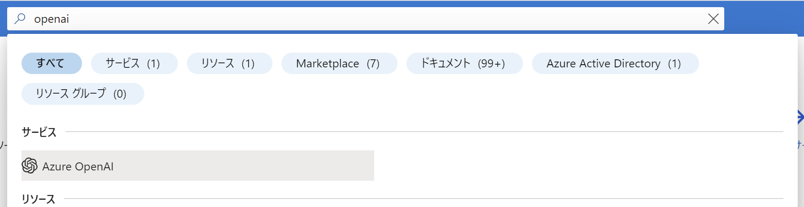

1. 「Azure OpenAI」の一覧上部にある「作成」を選択

    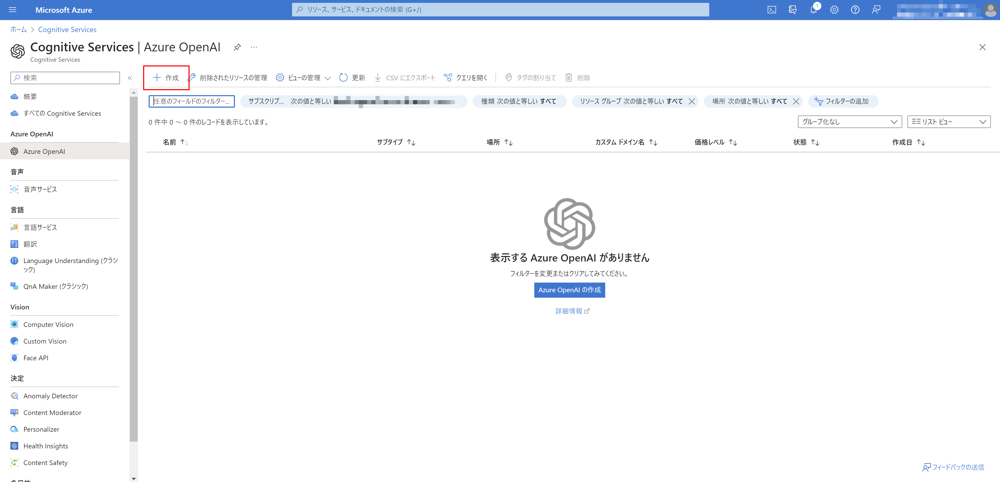

1. 「Azure OpenAI」の作成

    1. 「基本」ページ

        * サブスクリプション： （今回利用予定のサブスクリプション）
        * リソースグループ：（作成済みのもの）
        * リージョン： `East US`
        * 名前： （任意名称。 **グローバルで一意になるよう注意** ）
        * 価格レベル： `Standard S0`

        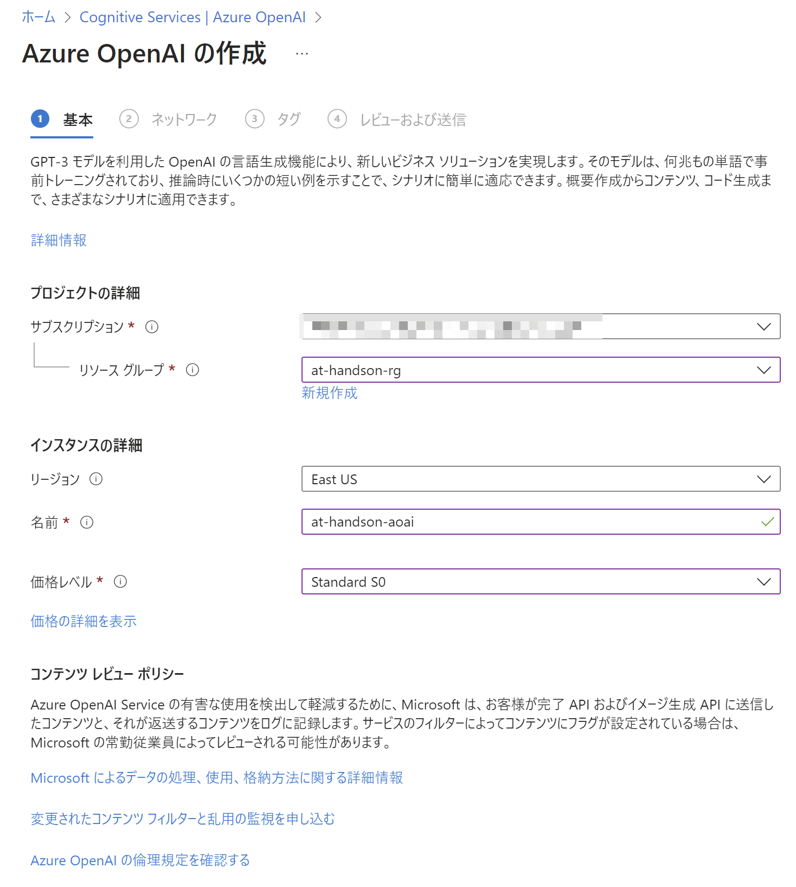

    1. 「ネットワーク」ページ

        * インターネットを含むすべてのネットワーク

        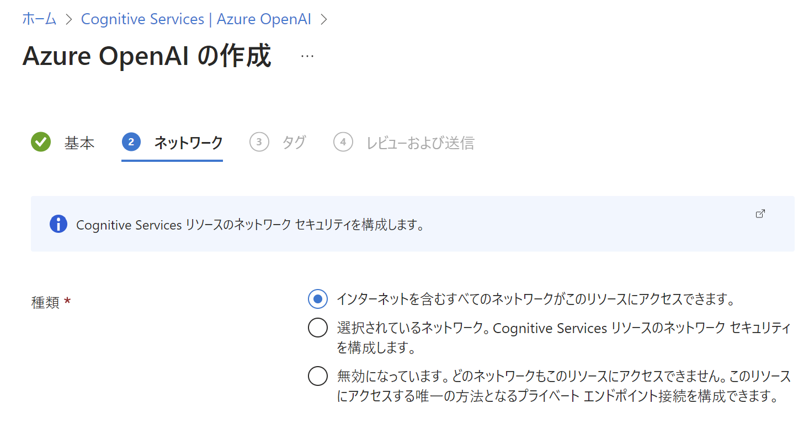

    1. 「タグ」ページ

        （指定なし。デフォルトまま。）

    1. 「レビューおよび送信」ページ

        内容を確認して「作成」を選択

        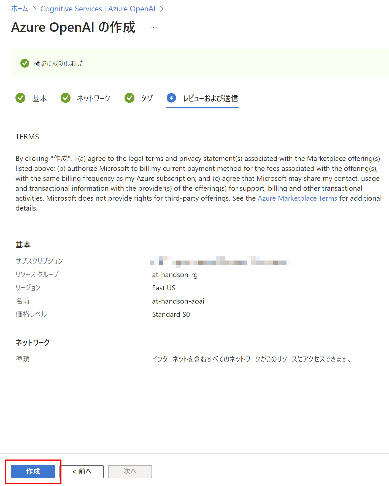

1. 作成完了後、一覧に作成したリソースグループが出てきていることを確認

## デプロイモデル作成

1. 作成した「Azure OpenAI」リソースへ移動

    (*) デプロイ済みのページで「リソースに移動」で移動可能。
        または、Azure OpenAI の一覧から探す。

1. [リソース管理]-[モデルデプロイ]を開き、「展開の管理」を開く

    (*) うまく開けない場合 https://oai.azure.com/portal を直接開く

    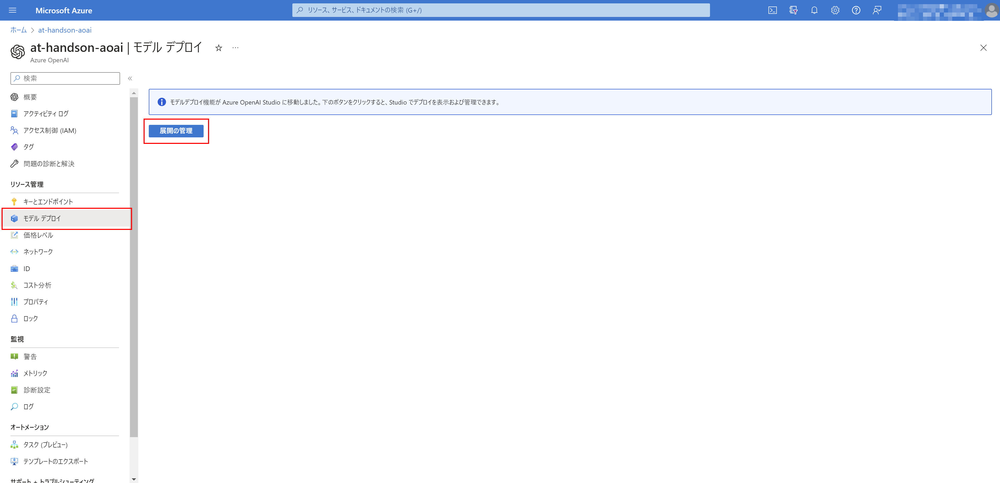

1. [管理]-[デプロイ] を開き、「新しいデプロイの作成」を選択

    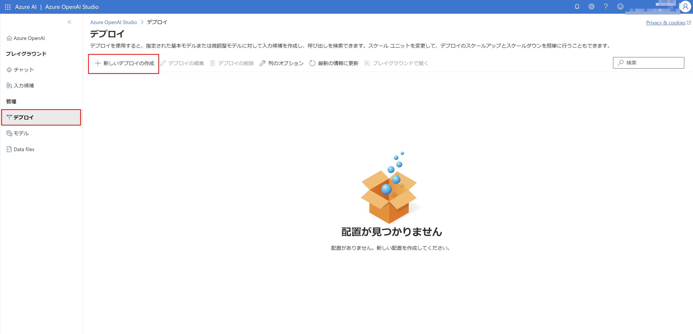

1. モデルのデプロイを設定して「作成」

    * モデル： `gpt-35-turbo`
    * スケーリング： `1`
    * デプロイ名： （任意名称）

    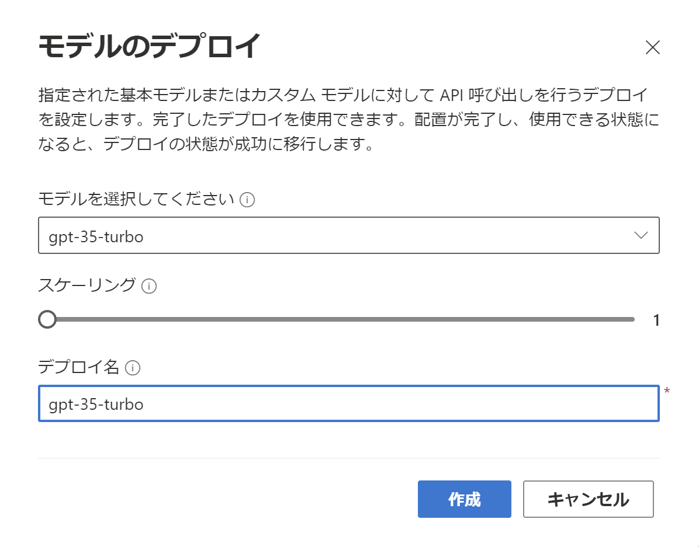

1. 一覧に作成したモデルが表示されれば完了

    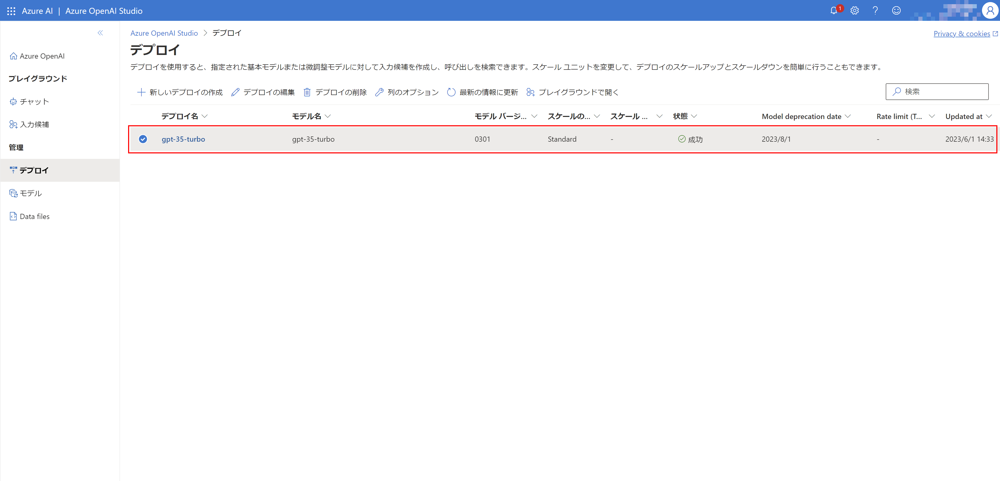


## プレイグラウンドでテスト

1. 「 [Azure OpenAI Studio](https://oai.azure.com/portal) 」を開く

    ※前の作業の続きの場合、改めて開かなくてもOK

    https://oai.azure.com/portal

1. [プレイグラウンド]-[チャット] を開く

    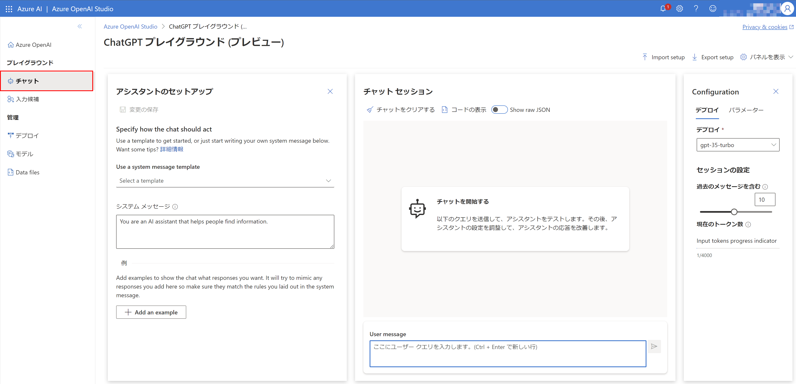

1. 「チャット」を試す

    1. 「アシスタントのセットアップ」に system プロンプトを設定

        ```
        関西弁で回答する
        ```

    1. 「チャットセッション」に user プロンプト を投入

        ```
        Azureの良さを教えてください。
        ```

        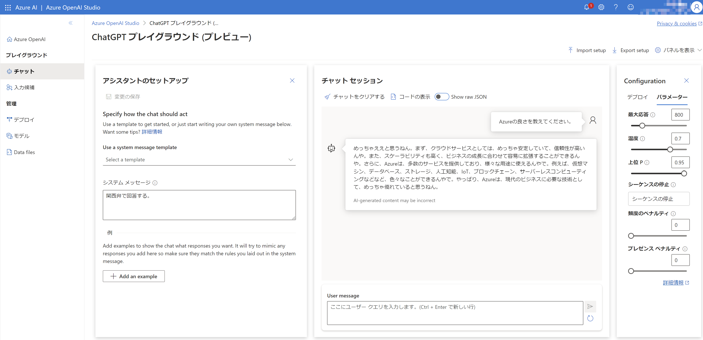


