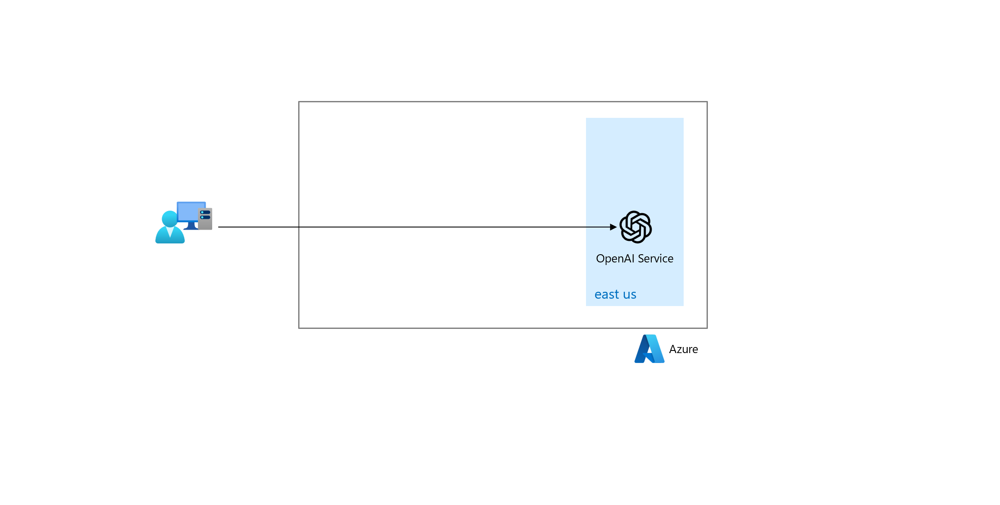
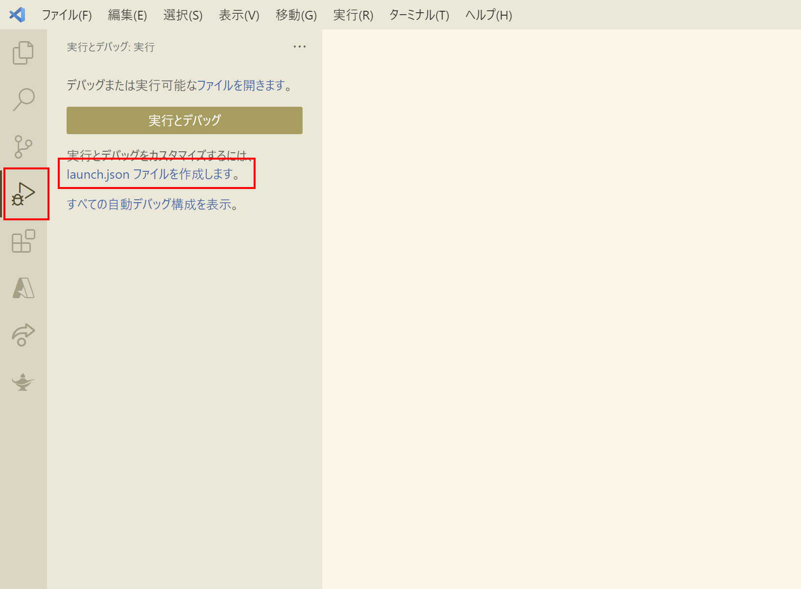
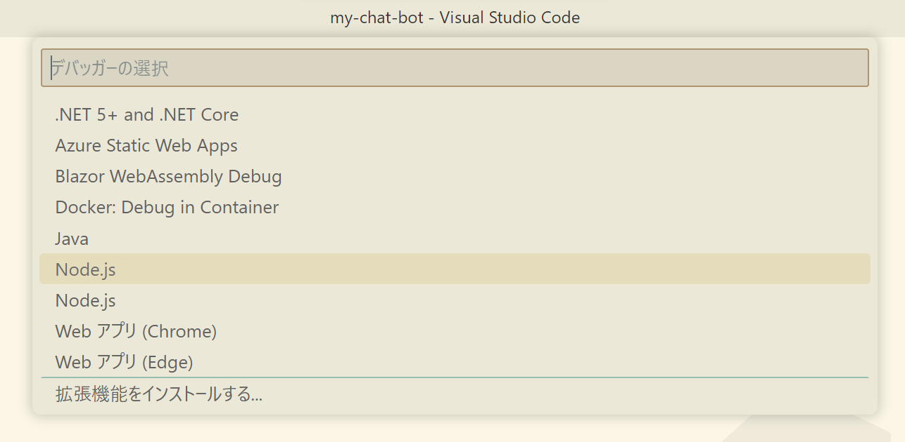
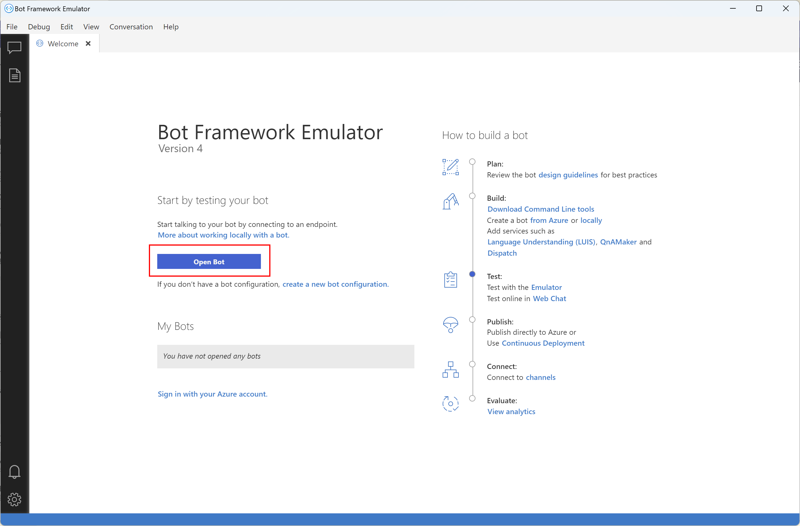
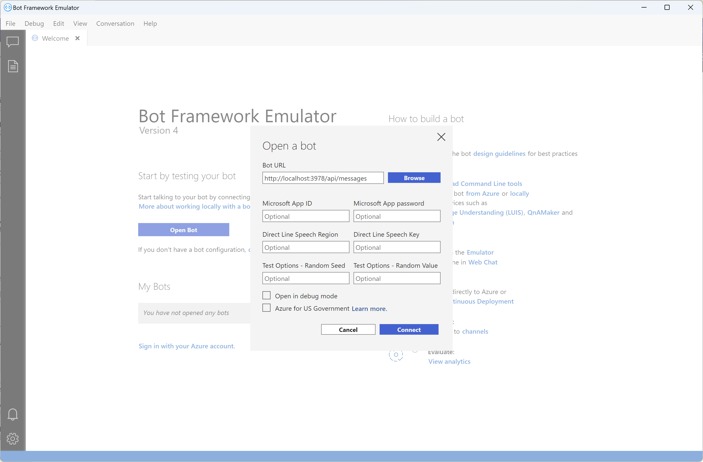
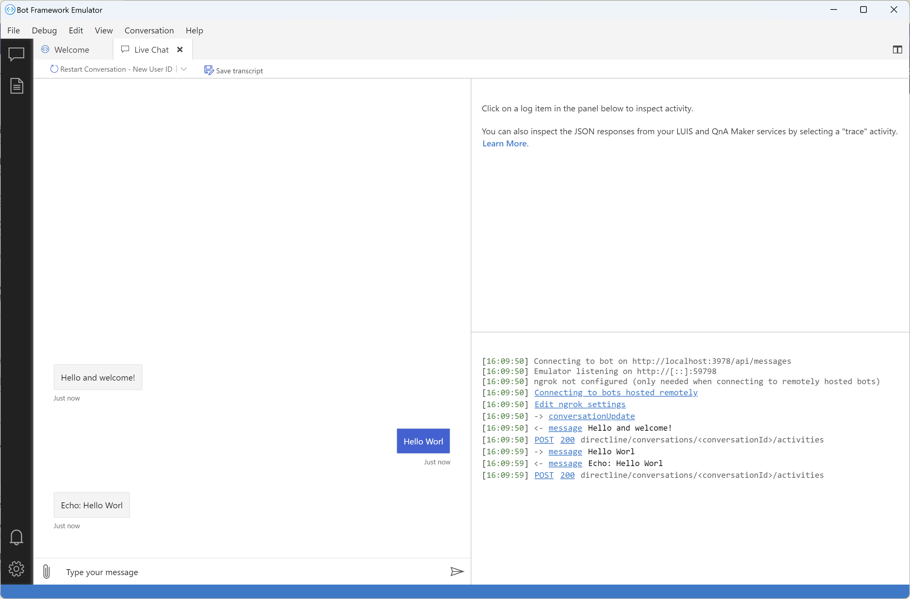
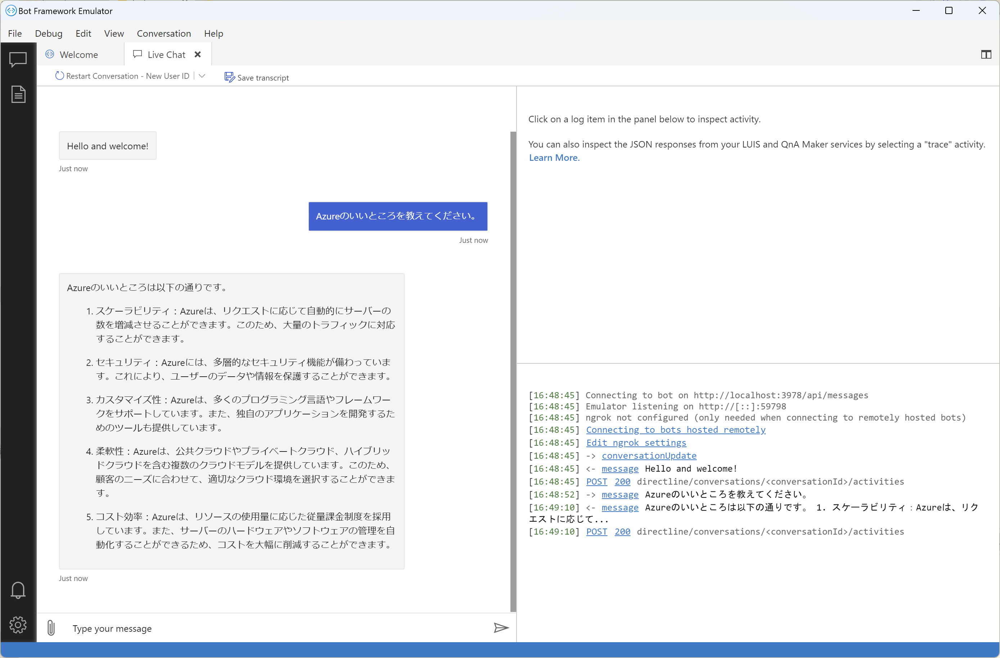

# Exercise3: Bot Service ローカル開発

## 【目次】



1. [プロジェクトひな形作成](#プロジェクトひな形作成)
1. [ひな形のテスト実行](#ひな形のテスト実行)
1. [AOAI接続の実装](#aoai接続の実装)
1. [AOAI接続のテスト実行](#aoai接続のテスト実行)

## プロジェクトひな形作成

1. 適当なフォルダを作成してターミナル（cmd.exe）で開く

1. 初期化

    ```
    npm init -y
    ```

1. 必要パッケージインストール

    ```
    npm install --save-dev yo generator-botbuilder
    ```

1. ひな形作成

    ```
    npx yo botbuilder
    ```

    ```
    ? What's the name of your bot? my-chat-bot
    ? What will your bot do? Demonstrate the core capabilities of the Microsoft Bot Framework
    ? What programming language do you want to use? JavaScript
    ? Which template would you like to start with? Echo Bot - https://aka.ms/bot-template-echo
    ? Looking good.  Shall I go ahead and create your new bot? Yes
    ```

## ひな形のテスト実行

1. 作成したひな形フォルダ `my-chat-bot` を Visual Studio Code で開く

1. 「実行とデバッグ」へ移動し「launch.jsonファイルを作成」リンクを開く

    

1. 「Node.js」を選択

    

1. 作成された `launch.json` に `envFile` を追記

    ```
    {
      "version": "0.2.0",
      "configurations": [
        {
          "type": "node",
          "request": "launch",
          "name": "プログラムの起動",
          "skipFiles": [
            "<node_internals>/**"
          ],
          "program": "${workspaceFolder}/index.js",
          "envFile": "${workspaceFolder}/.env"
        }
      ]
    }
    ```

1. [実行]-[デバッグの開始] （または `F5` キー）でデバッグ開始

1. Bot Emulator を起動、「Open Bot」を開く

    

1. `Bot URL` を設定して「Connect」

    * Bot URL: `http://localhost:3978/api/messages`

    

1. メッセージ入力してエコー（同じ文字列）が返ってくればOK

    

1. 動作確認ができたら、いったんデバッグ実行を停止


## AOAI接続の実装

1. 以下のモジュールを追加

    ```
    npm install axios
    ```

1. 以下を実装

    * `/bot.js`

        ```
        const { ActivityHandler, MessageFactory } = require('botbuilder');

        // ----------------- ADD START -----------------
        const axios = require('axios');

        const OPENAI_RESOURCE = process.env.OPENAI_RESOURCE;
        const OPENAI_DEPLOYMENT = process.env.OPENAI_DEPLOYMENT;
        const OPENAI_API_VERSION = process.env.OPENAI_API_VERSION;
        const OPENAI_API_KEY = process.env.OPENAI_API_KEY;
        const OPENAI_COMPLETION_ENDPOINT = `https://${ OPENAI_RESOURCE }.openai.azure.com/openai/deployments/${ OPENAI_DEPLOYMENT }/chat/completions?api-version=${ OPENAI_API_VERSION }`;
        // ----------------- ADD END -----------------

        class EchoBot extends ActivityHandler {
            constructor() {

        ... (省略) ...

                this.onMessage(async (context, next) => {
                    // ----------------- MODIFY START -----------------
                    try {
                        const payload = {
                            messages: [
                                { role: 'user', content: context.activity.text }
                            ]
                        };
                        const response = await axios.post(
                            OPENAI_COMPLETION_ENDPOINT,
                            payload,
                            {
                                headers: {
                                    'Content-Type': 'application/json',
                                    'api-key': OPENAI_API_KEY
                                }
                            });
                        const message = response.data?.choices[0]?.message?.content;
                        await context.sendActivity(message);
                    } catch (err) {
                        console.log(err);
                        await context.sendActivity('Sorry, something went wrong.');
                    }
                    await next();
                    // ----------------- MODIFY END -----------------
                });

        ... (省略) ...

            }
        }

        module.exports.EchoBot = EchoBot;
        ```

    * `/.env`

        ```
        ... (省略) ...
        # ----------------- ADD START -----------------
        OPENAI_RESOURCE={Azure OpenAI Service のリソース名}
        OPENAI_DEPLOYMENT={Azure OpenAI Service のリソース内に作成したデプロイ名}
        OPENAI_API_VERSION=2023-03-15-preview
        OPENAI_API_KEY={Azure OpenAI Service の APIキー}
        # ----------------- ADD END -----------------
        ```

        (*) APIキーは Azure OpenAI Service のリソースを開き [リソース管理]-[キーとエンドポイント] を参照

## AOAI接続のテスト実行

1. デバッグ実行を開始

1. Bot Emulator を開いて接続

1. チャットを実行して動作確認

    

