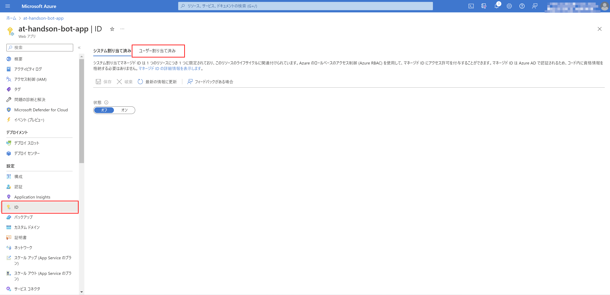
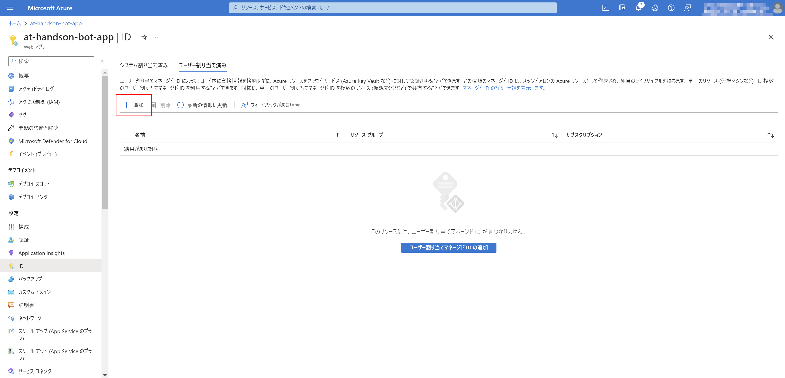
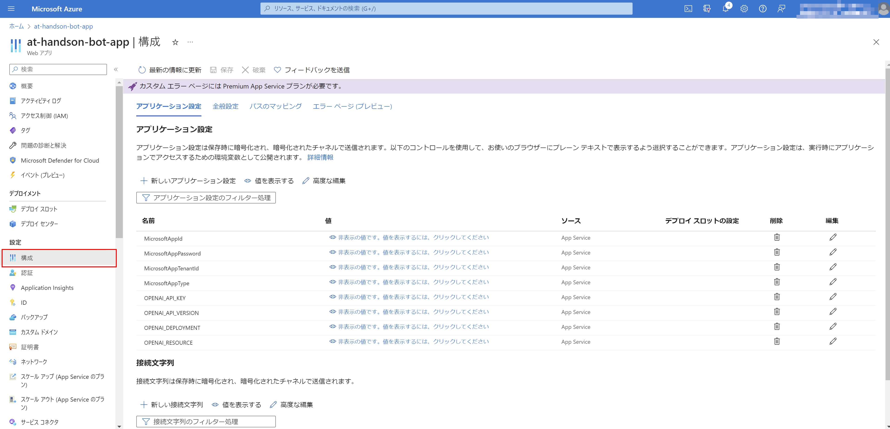
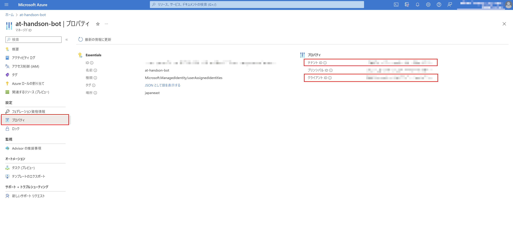
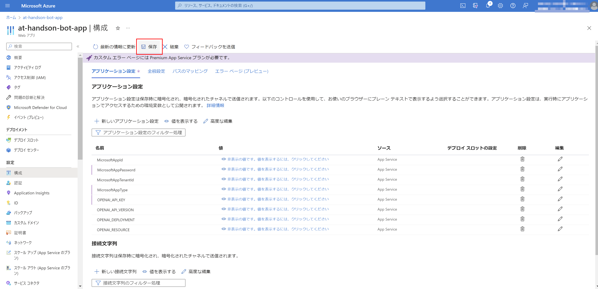
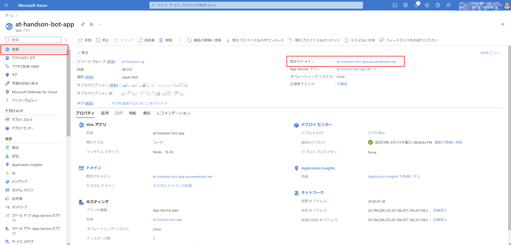
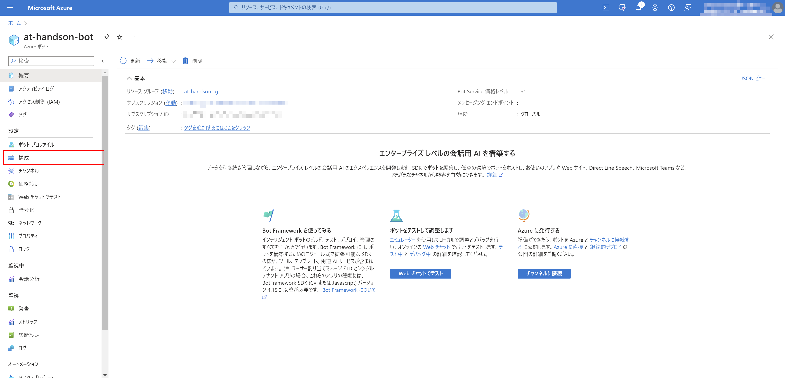
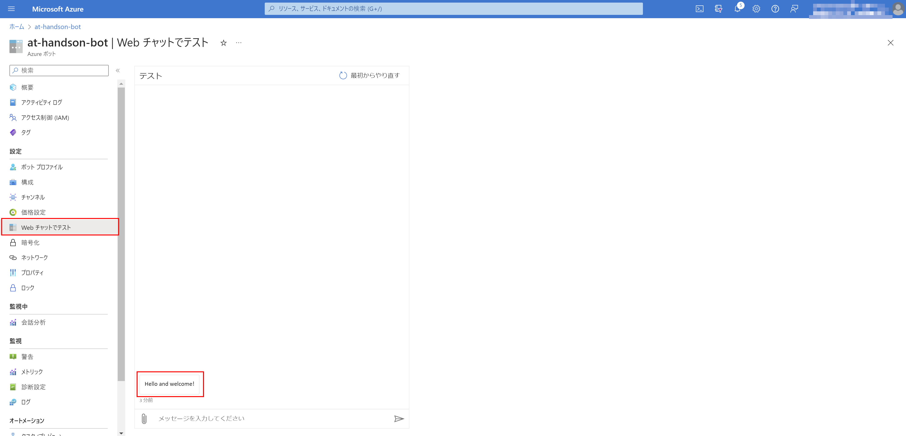
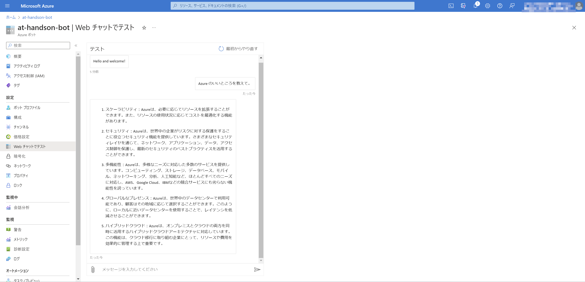

# Exercise4: Bot Service / App Service 設定/テスト

## 【目次】

1. [App Service の設定（マネージドID）]()
1. [App Service の設定（環境変数）]()
1. [Bot Service のテスト]()

## App Service の設定（マネージドID）

1. 作成済みの App Service を開く

1. [設定]-[ID]を開き、「ユーザー割り当て済み」タブへ移動

    

1. 「追加」を選択

    

1. 作成済み Botサービスと同名のマネージドIDを選択して「追加」

    

## App Service の設定（環境変数）

1. 作成済みの App Service を開く

1. [設定]-[構成]を開く

    

1. アップロード済みの変数に対して以下の値を設定

    |名前|値|
    |---|---|
    | `MicrosoftAppId` | (Botサービスと同名のユーザー割り当てマネージド ID のクライアント ID) |
    | `MicrosoftAppPassword` | (設定なし。空白のまま) |
    | `MicrosoftAppTenantId` | (Botサービスと同名のユーザー割り当てマネージド ID のテナント ID) |
    | `MicrosoftAppType` | `UserAssignedMSI` (固定値) |
    | `OPENAI_API_KEY` | (設定済み。 OpenAI Service のAPIキー) |
    | `OPENAI_API_VERSION` | (設定済み。利用予定の API Version) |
    | `OPENAI_DEPLOYMENT` | (設定済み。 OpenAI Service のデプロイ名) |
    | `OPENAI_RESOURCE` | (設定済み。 OpenAI Service のリソース名) |

    * マネージドIDのクライアントID、テナントID

        マネージドIDを開き、[設定]-[プロパティ]を確認

        

1. 設定を「保存」

    

## Bot Service の設定

1. App Service の概要ページから「既定のドメイン」を取得

    

1. Bot Service を開き、[設定]-[構成]を開く

    

1. 「メッセージング エンドポイント」を設定して「適用」

    * メッセージングエンドポイント： `https://{前述手順で取得したAppServiceのドメイン}/api/messages`

## Bot Service のテスト

1. [設定]-[Webチャットでテスト]を開き、初期メッセージが表示されることを確認

    

    表示されない場合、以下を試してみる

    * 時間をあけて画面リフレッシュ
    * App Service の設定（マネージドID、環境変数）を確認
    * App Service を再起動
    * Bor Service から App Service を参照するURLを再確認

1. 任意のチャットを行って返信があることを確認

    
