# Exercise4: Teamsチャンネル作成/テスト

## 【目次】


1. [Teamsチャンネル作成]()
1. []()
1. []()
1. []()

## Teamsチャンネル作成

1. 作成済みのBot Serviceを開き、[設定]-[チャンネル]を開く

    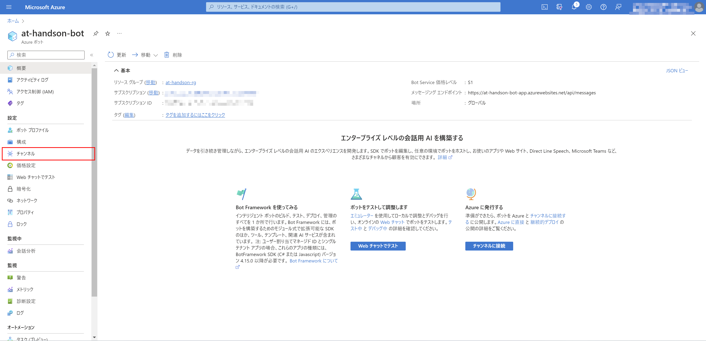

1. 「Microsoft Teams」を選択

    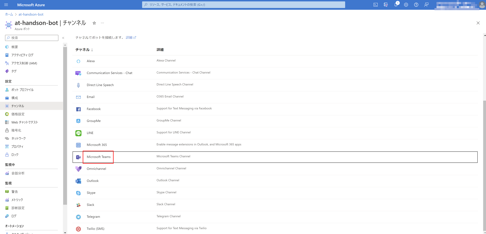

1. サービス条件を確認して「同意」

    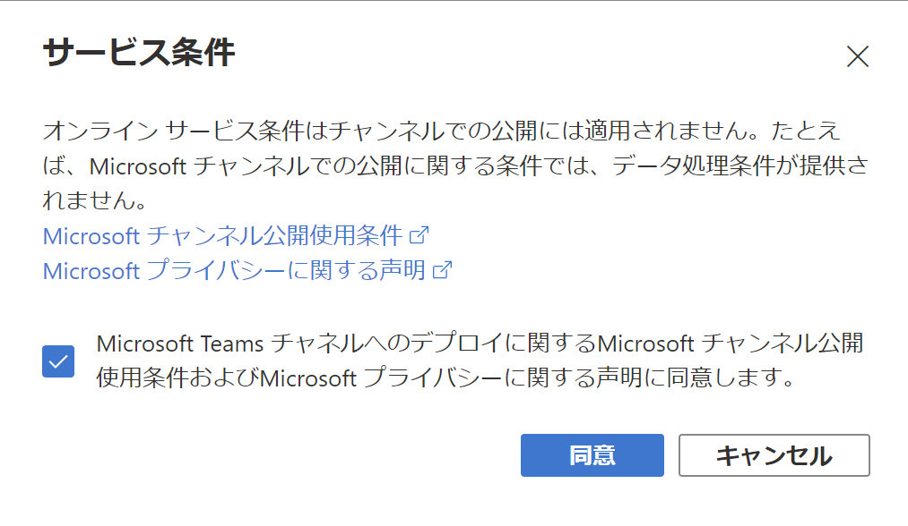

1. 「microsoft Teams Commercial」を選択して「適用」

    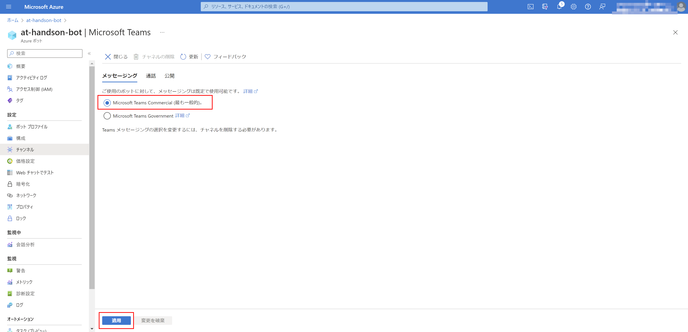

1. 作成完了したら「閉じる」

    


## Teamsチャンネルテスト

1. Bot Service を開き、[設定]-[チャンネル]を開く

1. 作成済みの「Microsoft Teams」チャンネルのアクションにある「Open in Teams」を開く

    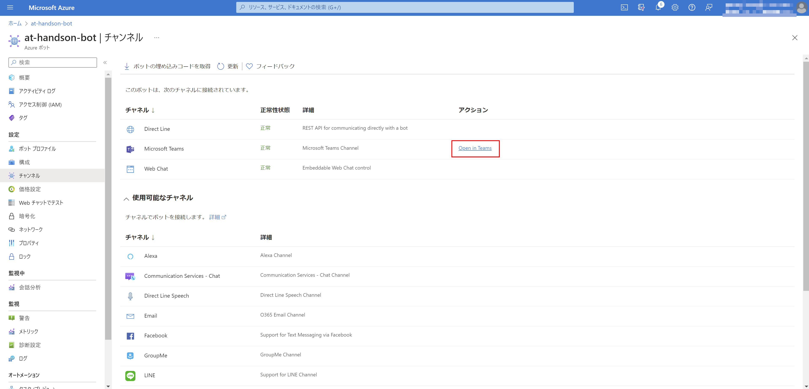

1. 任意のメッセージを送って動作確認

    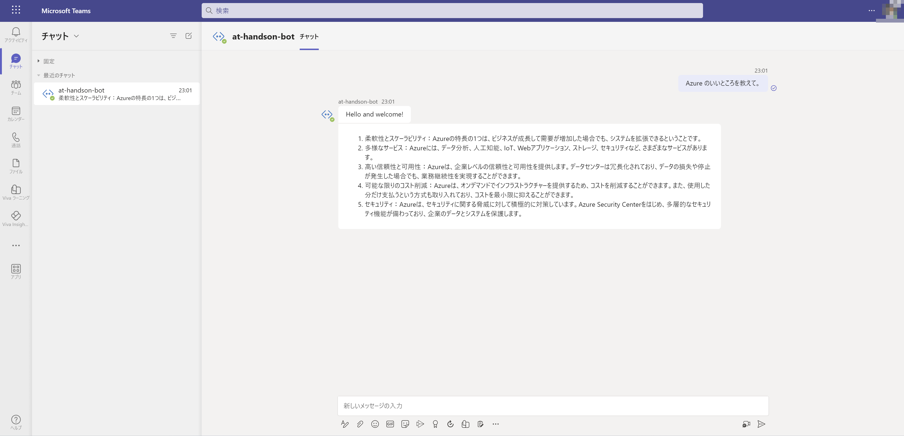


## Teamsアプリ作成

1. アプリ作成用のフォルダを任意の場所に作成

1. 以下の構成になるようファイルを取得、配置

    * 【フォルダ構成】

        ```
        <ROOT>
        | manifest.json
        | bot-icon-large.png
        | bot-icon-small.png
        ```

    * 【ファイルの取得元】

        | ファイル名 | 取得元 | 補足 |
        |---|---|---|
        | `manifest.json` | [リンク](https://raw.githubusercontent.com/akinaritsugo/handson-aoai-chatbot/main/recources/teams-app-pkg/manifest.json) | Teamsアプリの定義ファイル |
        | `bot-icon-large.png` | [リンク](https://raw.githubusercontent.com/akinaritsugo/handson-aoai-chatbot/main/recources/teams-app-pkg/bot-icon-large.png) | Teamsアプリ小アイコン。透明な 32x32 PNG アウトライン アイコン。 |
        | `bot-icon-small.png` | [リンク](https://raw.githubusercontent.com/akinaritsugo/handson-aoai-chatbot/main/recources/teams-app-pkg/bot-icon-small.png) | Teamsアプリ大アイコン。フル カラーの 192x192 PNG アイコン。 |

1. `manifest.json` のプレースホルダーを修正

    (*) スキーマの詳細は「 [Teams のアプリ マニフェストのスキーマ](https://learn.microsoft.com/microsoftteams/platform/resources/schema/manifest-schema) 」を参照

    | プレースホルダー名 | 説明 |
    |---|---|
    | `{MICROSOFT_APP_ID}` | **2箇所ある。** Botサービスと同名のマネージドIDのクライアントID。 |
    | `{YOUR_NAME}` | アプリの発行者名（任意名称） |

1. できあがったフォルダを1つのzipファイルに圧縮

    ```
    <ZIP_FILE_ROOT>
    | manifest.json
    | bot-icon-large.png
    | bot-icon-small.png
    ```

## Teamsアプリの登録

1. Teams を開き、「アプリ」を選択

    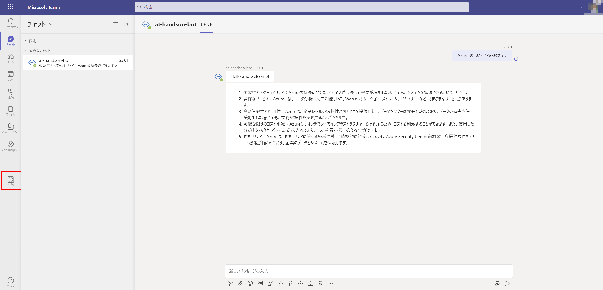

1. 「アプリを管理」、「アプリをアップロード」を選択

    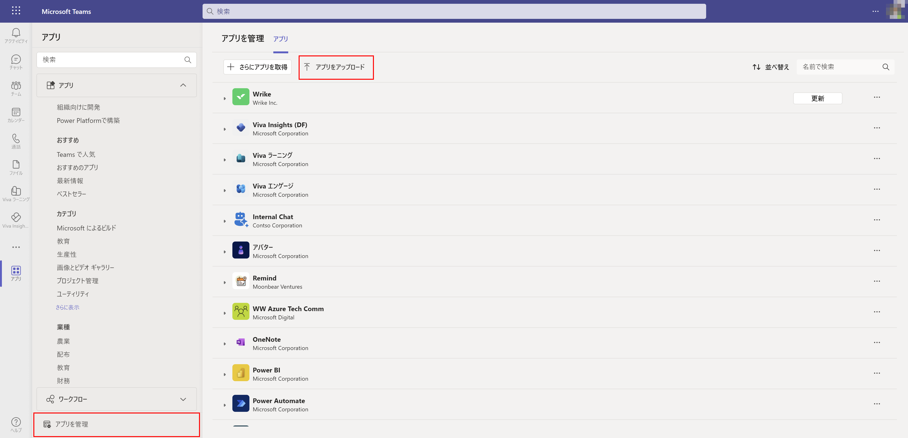

1. 「カスタムアプリをアップロード」を選択

    前手順で作成した zipファイル をアップロード

    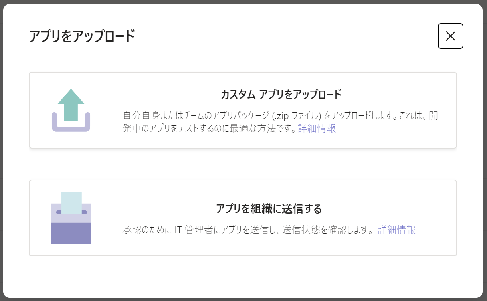

1. 「追加」を選択

    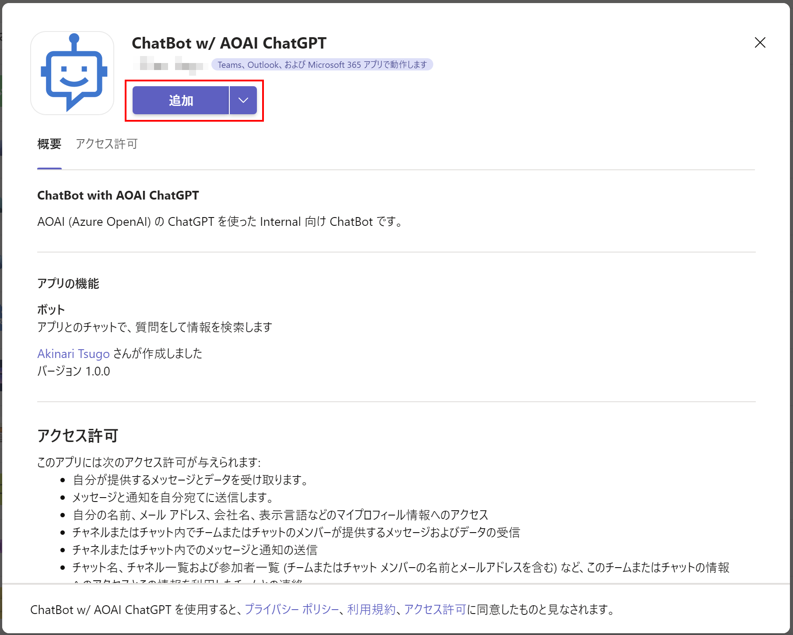

1. アプリが追加されたことを確認

    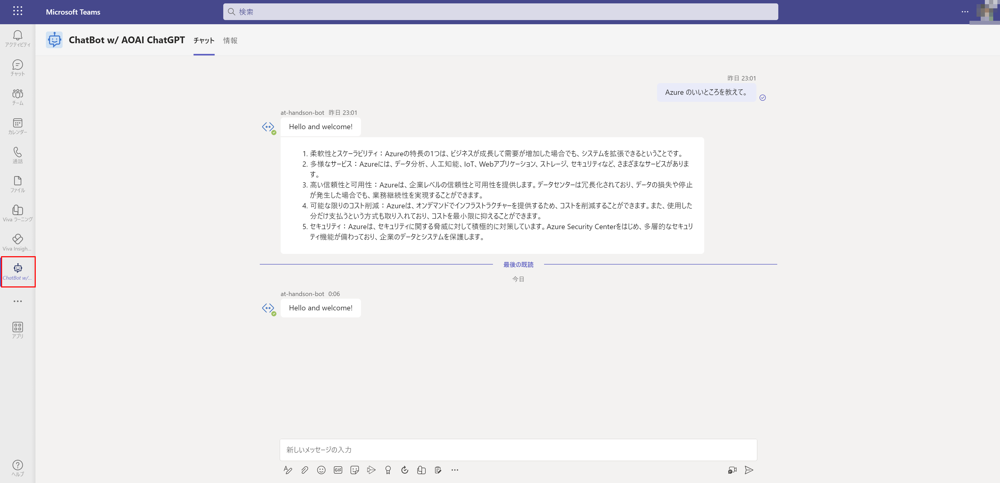


